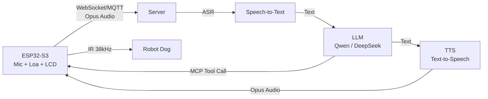
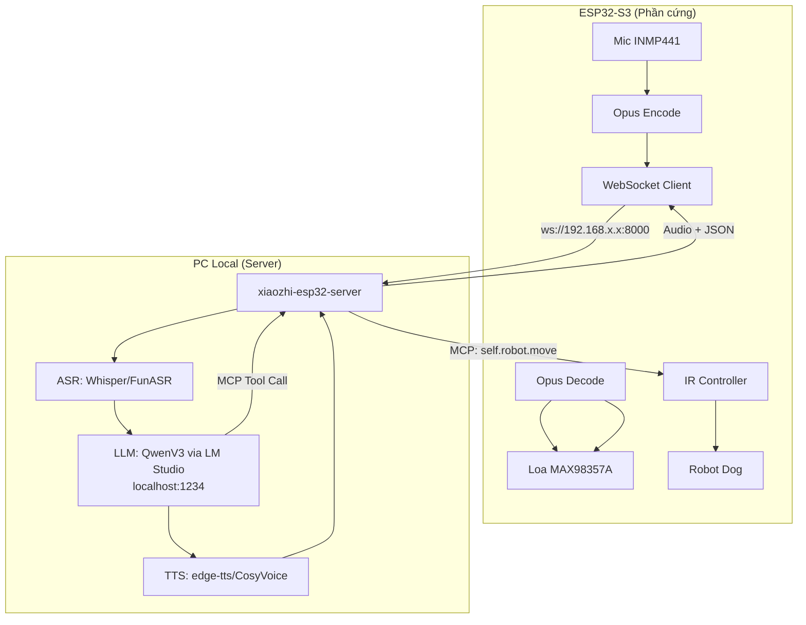

# 📋 Tổng Quan Dự Án XiaoZhi ESP32 & Chuyển Sang QwenV3 Local

## 1. Dự Án Là Gì?

**XiaoZhi ESP32** là một chatbot AI dạng phần cứng chạy trên ESP32-S3, sử dụng kiến trúc:

```
Giọng nói → ESP32 (micro) → Server (ASR + LLM + TTS) → ESP32 (loa)
```

> [!IMPORTANT]
> ESP32 **KHÔNG chạy LLM trực tiếp**. Nó chỉ là client — thu giọng nói, gửi lên server qua WebSocket/MQTT, nhận kết quả về phát loa. **Toàn bộ AI (ASR, LLM, TTS) chạy trên server**.

### Kiến trúc hệ thống



---

## 2. Luồng Kết Nối ESP32 → Server

### Bước 1: OTA Check Version
ESP32 gọi API OTA (`CONFIG_OTA_URL` = `https://api.tenclass.net/xiaozhi/ota/`) để:
- Kiểm tra firmware mới
- **Nhận cấu hình server** (WebSocket URL + token)

Server trả về JSON chứa:
```json
{
  "websocket": {
    "url": "wss://server.xiaozhi.me/ws",
    "token": "Bearer xxx",
    "version": 2
  }
}
```

Cấu hình này được lưu vào **NVS** (flash) namespace `"websocket"`.

### Bước 2: Kết nối WebSocket
Khi user nói (wake word / bấm nút), ESP32:
1. Đọc URL từ NVS: `Settings("websocket").GetString("url")`
2. Kết nối WebSocket đến URL đó
3. Gửi `hello` message → chờ server trả `hello`
4. Bắt đầu stream audio Opus qua WebSocket

### Bước 3: Server xử lý
Server nhận audio → ASR → LLM → TTS → trả audio + JSON về ESP32

> [!NOTE]
> Code liên quan:
> - [ota.cc](file:///d:/project/xiaozhi-esp32-main/main/ota.cc) — nhận websocket config từ OTA API (dòng 167-186)
> - [websocket_protocol.cc](file:///d:/project/xiaozhi-esp32-main/main/protocols/websocket_protocol.cc) — kết nối & giao tiếp
> - [application.cc](file:///d:/project/xiaozhi-esp32-main/main/application.cc) — khởi tạo protocol (dòng 473-610)

---

## 3. Tính Năng IR Control (Robot Dog)

Dự án đã tích hợp thành công **điều khiển Robot Dog bằng giọng nói qua IR**:

| Thành phần | Mô tả |
|---|---|
| **LED IR TX** | GPIO46 — phát sóng mang 38kHz |
| **VS1838B RX** | GPIO42 — thu + tự chẩn đoán loopback |
| **MCP Tool** | `self.robot.move` — AI gọi khi user nói "đi thẳng", "quay trái"... |
| **Giao thức** | 9 frame/lần, 8-bit MSB-first, carrier 38kHz |

Luồng hoạt động:
```
"quay trái" → ASR → LLM → MCP Tool call (command=left)
  → ESP32 phát IR 0x0D × 9 frame → Robot Dog quay trái
```

> [!NOTE]
> Code: [ir_robot_controller.cc](file:///d:/project/xiaozhi-esp32-main/main/boards/bread-compact-wifi-s3cam/ir_robot_controller.cc)
> Docs: [README_IR_CONTROL.md](file:///d:/project/xiaozhi-esp32-main/README_IR_CONTROL.md)

---

## 4. Chuyển Sang QwenV3 Trên LM Studio — Có Được Không?

### Trả lời ngắn: **CÓ, nhưng cần một server trung gian**

> [!IMPORTANT]
> ESP32 không gọi LLM API trực tiếp. Nó kết nối đến **một server** qua WebSocket. Server đó mới gọi LLM.
> → Bạn cần chạy **xiaozhi-esp32-server** (Python/Java/Go) trên máy tính, và cấu hình server đó dùng QwenV3 từ LM Studio.

### Các bước thực hiện

#### Bước 1: Cài LM Studio + Load QwenV3
- Tải LM Studio, load model Qwen3 (ví dụ `qwen3-8b`)
- LM Studio sẽ expose API tại `http://localhost:1234/v1/` (OpenAI-compatible)

#### Bước 2: Cài xiaozhi-esp32-server trên PC
Chọn một trong các server open-source:

| Server | Ngôn ngữ | Link |
|---|---|---|
| **xinnan-tech/xiaozhi-esp32-server** | Python | [GitHub](https://github.com/xinnan-tech/xiaozhi-esp32-server) |
| joey-zhou/xiaozhi-esp32-server-java | Java | [GitHub](https://github.com/joey-zhou/xiaozhi-esp32-server-java) |
| AnimeAIChat/xiaozhi-server-go | Go | [GitHub](https://github.com/AnimeAIChat/xiaozhi-server-go) |

**Khuyến nghị**: Dùng bản Python (`xinnan-tech/xiaozhi-esp32-server`) vì phổ biến và dễ cấu hình.

#### Bước 3: Cấu hình server dùng LM Studio
Trong file config của xiaozhi-esp32-server, đổi LLM endpoint sang LM Studio:
```yaml
# Ví dụ config (tùy phiên bản server)
llm:
  type: openai
  base_url: "http://localhost:1234/v1"
  model: "qwen3-8b"
  api_key: "lm-studio"  # LM Studio không cần key thật
```

#### Bước 4: Cấu hình ESP32 trỏ về server local

Có **2 cách**:

**Cách 1: Đổi OTA URL** (trong `menuconfig`)
```
idf.py menuconfig
→ Xiaozhi Assistant → Default OTA URL
→ Đổi thành URL server local (ví dụ: http://192.168.1.100:8000/xiaozhi/ota/)
```

**Cách 2: Đổi trực tiếp WebSocket URL qua NVS**
Nếu server local expose WebSocket, bạn có thể flash NVS với URL mới.

> [!WARNING]
> **ASR (Speech-to-Text) và TTS (Text-to-Speech)** cũng cần chạy trên server. LM Studio chỉ cung cấp LLM.
> Server xiaozhi-esp32-server thường tích hợp sẵn ASR (Whisper/FunASR) và TTS (edge-tts/CosyVoice).
> Bạn cần đảm bảo cả 3 thành phần: **ASR + LLM + TTS** đều hoạt động trên máy local.

---

## 5. Tóm Tắt Kiến Trúc Sau Khi Chuyển



## 6. Checklist Nhanh

- [ ] Cài LM Studio + load QwenV3 model
- [ ] Clone & cài [xiaozhi-esp32-server](https://github.com/xinnan-tech/xiaozhi-esp32-server) 
- [ ] Cấu hình server: LLM → LM Studio endpoint, ASR → Whisper/FunASR, TTS → edge-tts
- [ ] Chạy server trên PC (cùng mạng WiFi với ESP32)
- [ ] Đổi `CONFIG_OTA_URL` trong ESP32 firmware trỏ về server local
- [ ] Build & flash firmware mới: `idf.py build && idf.py -p COM5 flash monitor`
- [ ] Test: nói "đi thẳng" → xem log IR trên Serial Monitor

> [!TIP]
> Đảm bảo PC và ESP32 **cùng mạng WiFi**. Server cần bind lên `0.0.0.0` thay vì `localhost` để ESP32 kết nối được.
